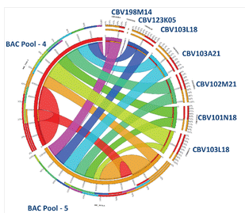

[(Nucleomics-VIB)](https://github.com/Nucleomics-VIB)
 - Circos-Tools
==========

*All tools presented below have only been tested by me and may contain bugs, please let me know if you find some. Each tool relies on dependencies normally listed at the top of the code (cpan for perl and cran for R will help you add them)*

Please refer to the accompanying **[wiki](https://github.com/Nucleomics-VIB/circos-tools/wiki)** for examples and workflows.

## template
*[[back-to-top](#top)]*  

Those additional tools belong on a Shiny server and will execute R code in a interactive manner (please refder to https://shiny.rstudio.com/ for info about Shiny).

### **template** 

The **[fai2circoskaryotype.sh](fai2circoskaryotype.sh)** script converts a .fai index into a circos karyotype file.

*[[back-to-top](#top)]*  

<h4>Please send comments and feedback to <a href="mailto:nucleomics.bioinformatics@vib.be">nucleomics.bioinformatics@vib.be</a></h4>

This work is licensed under a [Creative Commons Attribution-ShareAlike 3.0 Unported License](http://creativecommons.org/licenses/by-sa/3.0/).
